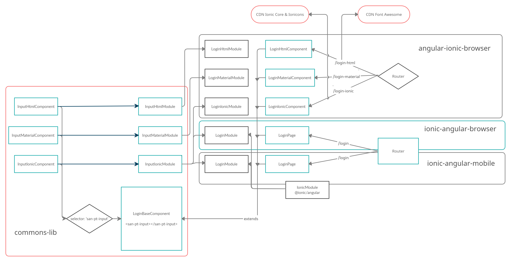

# Prueba Técnica Sanitas

Multiproyecto Angular/Ionic de la prueba técnica.

Se ha escogido este formato de arquetipo por su capacidad de reutilización a la hora de componetizar la prueba técnica, como también su capacidad de centralizar configuraciones de angular y de karma directorios de recursos etc.

El proyecto consta de 4 subproyectos.

[](estructura.png)

## commons-lib

Librería de componentes y templates que es dependencia directa del resto de subproyectos.

Para la prueba técnica se introduce la referencia de la carpeta dist de la librería en el tsconfig de cada subproyecto, en un entorno real esto se debería gestionar a través de un repositorio de npm o en formato de webcomponents.

### Comandos
```
install: npm install (es el proyecto por defecto).
build: npm run build | ng build (es el proyecto por defecto).
test: npm run t | ng test --codeCoverage=true --commons-lib
start: npm run start:commons (watch for compilation)

```

## angular-ionic-browser

Proyecto Angular que hace uso del proyecto commons-lib no tiene dependencia directa con ionic (npm dependency), pero si hace uso de ionic en tiempo de ejecución a través de su CDN.

Consta de 3 rutas en la que haciendo uso de un módulo u otro se inyecta:

login-html: html simple con iconos de FontAwesome a través de CDN.
login-material: etiquetas html de angular material con iconos de propios de material a través de dependencia npm.
login-ionic: etiquetas html de ionic con iconos de ionicon a través de CDN.

### Comandos
```
install: npm run i:aib | npm i --workspace=angular-ionic-browser
build: npm run build:aib | ng build angular-ionic-browser
test: npm run t:aib | ng test --codeCoverage=true --project angular-ionic-browser
start: npm run start:aib ng serve angular-ionic-browser

```

## ionic-angular-browser

Proyecto Ionic/Angular que hace uso del proyecto commons-lib tiene dependencia directa con @ionic/angular (npm dependency) en tiempo de compilación.

Consta de 1 ruta autoresuelta haciendo uso del módulo de commons-lib:

login: etiquetas html de ionic con iconos de ionicon resueltas a través del módulo IonicModule inyectado en el core de la aplicación.

El proyecto no tiene configurado capacitor.

### Comandos
```
install: npm run i:iab | npm i --workspace=ionic-angular-browser
build: npm run build:iab | ng build ionic-angular-browser
test: npm run t:iab | ng test --codeCoverage=true --project ionic-angular-browser
start: npm run start:iab ng serve ionic-angular-browser

```


## ionic-angular-mobile

Proyecto Ionic/Angular que hace uso del proyecto commons-lib tiene dependencia directa con @ionic/angular (npm dependency) en tiempo de compilación.

Consta de 1 ruta autoresuelta haciendo uso del módulo de commons-lib:

login: etiquetas html de ionic con iconos de ionicon resueltas a través del módulo IonicModule inyectado en el core de la aplicación.

El proyecto tiene configurado capacitor tanto para android como para ios.

### Comandos
```
install: npm run i:iam | npm i --workspace=ionic-angular-mobile
build: npm run build:iam | ng build ionic-angular-mobile
build-android: npm run build:iam:android | ionic cordova build android --prod ionic-angular-mobile
build-ios: npm run build:iam:ios | ionic cordova build android --prod ionic-angular-mobile
test: npm run t:iam | ng test --codeCoverage=true --project ionic-angular-mobile
start: npm run start:iam ionic serve --project ionic-angular-mobile

```


## Atajos (multiproyecto)
```
Full install: npm run i:full
Full build: npm run build:full
Full test: npm run t:full
Full start: npm run start:full

```

## Contenido

El contenido de la aplicación, consta de una página representada y con la funcionalidad solicitada cogiendo como referencia la imagen dispuesta en la prueba técnica.

## Mejoras

Aunque se escapa de del alcance de la prueba de concepto, suelo aplicar en todos los proyectos angular aunque no este el caso por su naturaleza multiproyecto, las siguientes configuraciones.

autoversionado incremental semántico condicionado por rama de git con semver ('beta' develop, pacth master).
husky git hooks pre-commit con lint, test --onlyChanged y autoversionado.
Testing Realtime wallaby para una mejor experiencia en los test.
Webpack post-processor conversion en base64 de todas las imagenes y reemplazo de la cadena
Webpack post-processor resolución de rutas relativas en templateUrls para compilaciones JIT e IVY
Webpack post-processor-stats stats del bundle generado.


